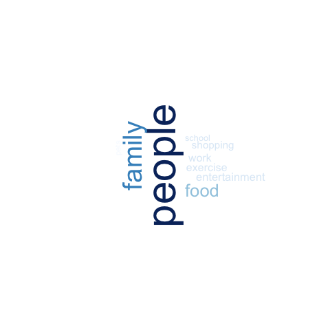
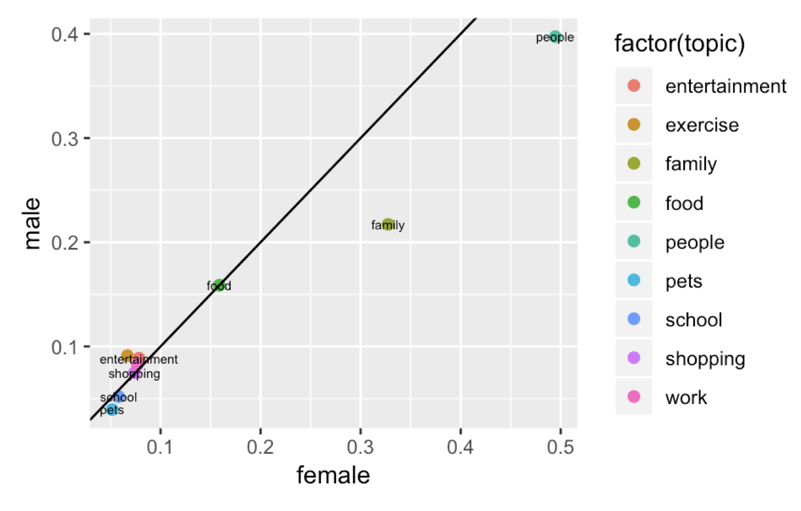
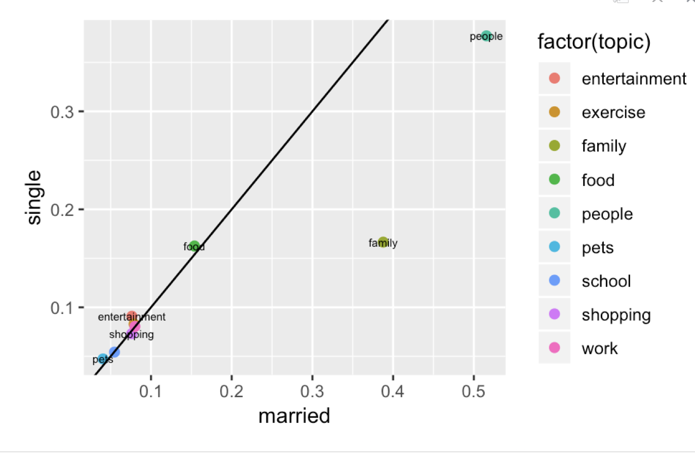
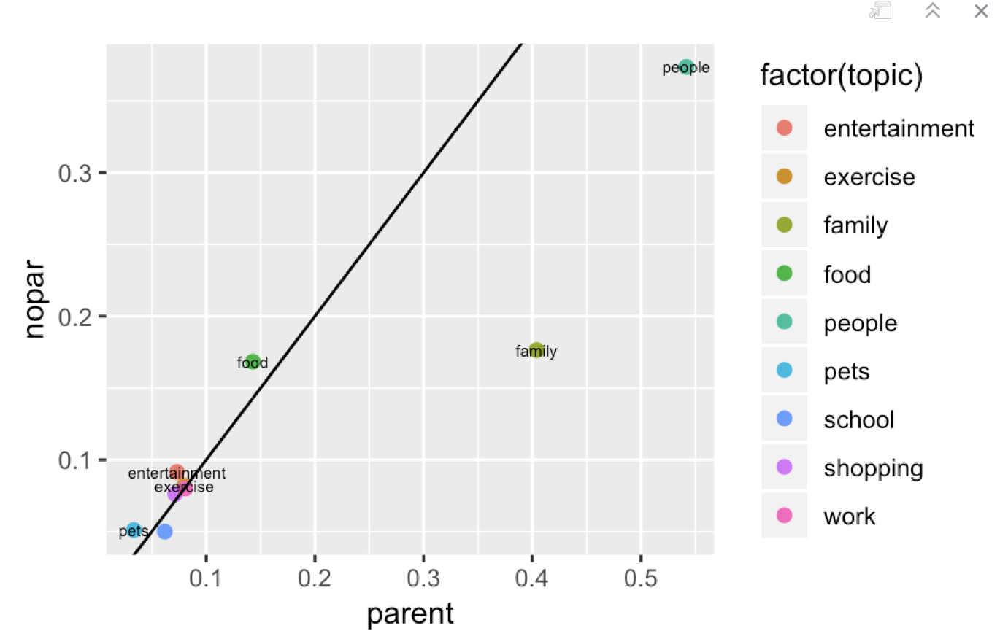
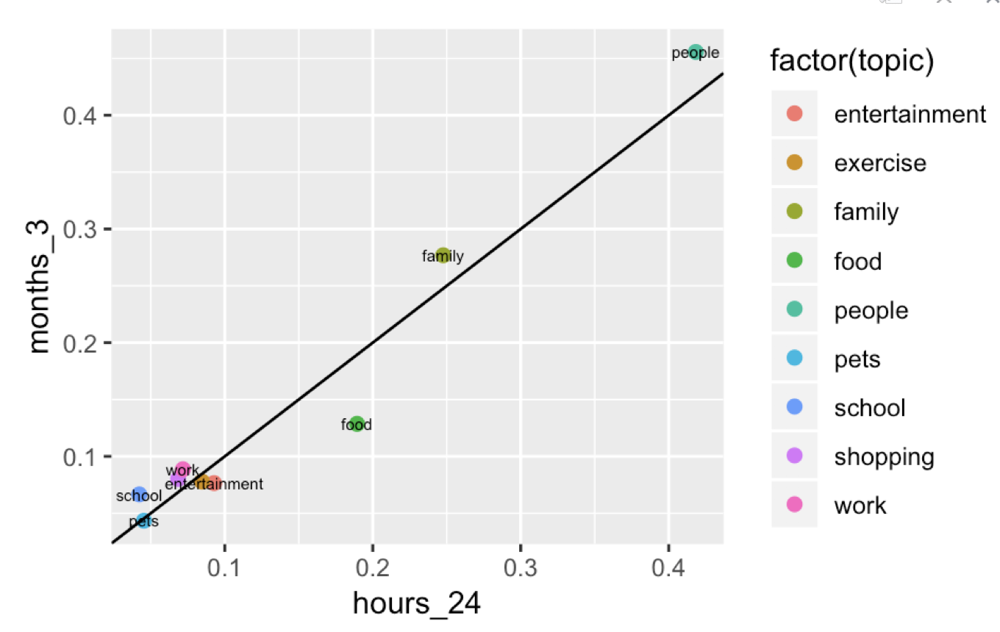

# Applied Data Science @ Columbia
## Fall 2018
## Project 1: What made you happy today?


### [Project Description](doc/)
This is the first and only *individual* (as opposed to *team*) this semester. 

Term: Fall 2018

+ Projec title: Lorem ipsum dolor sit amet
+ This project is conducted by [your name]

+ Project summary: [a short summary] Lorem ipsum dolor sit amet, consectetur adipiscing elit, sed do eiusmod tempor incididunt ut labore et dolore magna aliqua. Ut enim ad minim veniam, quis nostrud exercitation ullamco laboris nisi ut aliquip ex ea commodo consequat. Duis aute irure dolor in reprehenderit in voluptate velit esse cillum dolore eu fugiat nulla pariatur. Excepteur sint occaecat cupidatat non proident, sunt in culpa qui officia deserunt mollit anim id est laborum.

Following [suggestions](http://nicercode.github.io/blog/2013-04-05-projects/) by [RICH FITZJOHN](http://nicercode.githtitle.jpegub.io/about/#Team) (@richfitz). This folder is orgarnized as follows.

```
proj/
├── lib/
├── data/
├── doc/
├── figs/
└── output/
```

Please see each subfolder for a README file.


Summary:



From my data analysis, people mentioned "people" topic at highest frequency, including friend date etc.The second topic is "family" and the last one is "entertainment".




Compared to male, female mentioned "pets", "people" and "family" more frequently. And it seems that "exercise" and "entertainment" can give male more happiness.



Compared to signle, it makes sense that married people mentions "family" more when it comes to happiness. Single people favors "pets", "entertainment" and "food" more. "Shopping" can give similar happiness to these two groups of people.




Compared to no-parents, parents have more happiness in "family" and it often relates to children, for example, "son" "daughter". And it is interesting that parents mention "school" more often. My hypothesis is that parents feel happy when chilren success in shool. And it seems non parents enjoy food, food and entertainment more.




From this plot,  "food" and "entertainment" can provide immediate happiness during 24 hours. However, after 3 months, when people think of happy moments, they often came out with "family" and "people" moment. I believe this is because the feeling from family and friends last longer. And we probably forgot what the nicest food during last months.


